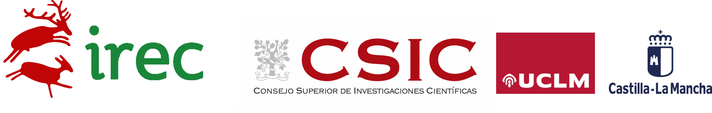

:::{#contact}

#### <i class="fa-solid fa-envelope"></i> &nbsp; fernando.alda@csic.es
#### <i class="fa-solid fa-phone"></i> &nbsp; (+34) 926 29 54 50
#### <i class="fa-solid fa-location-dot"></i> &nbsp; Instituto de Investigación en Recursos Cinegéticos, Ronda de Toledo 12, 13005 Ciudad Real, Spain

#### <i class="fa-brands fa-google-scholar"></i> &nbsp; [Google Scholar](https://scholar.google.es/citations?user=pqNxZC8AAAAJ&hl=en)
#### <i class="fa-brands fa-researchgate fa-lg"></i> &nbsp; [ResearchGate](https://www.researchgate.net/profile/Fernando-Alda/research)

:::

  <iframe src="https://www.google.com/maps/embed?pb=!1m18!1m12!1m3!1d3100.934236605149!2d-3.927348223406468!3d38.99399724099739!2m3!1f0!2f0!3f0!3m2!1i1024!2i768!4f13.1!3m3!1m2!1s0xd6bc367f7ee2be9%3A0xb254e4c01db1bb03!2sInstituto%20de%20Investigaci%C3%B3n%20en%20Recursos%20Cineg%C3%A9ticos%20I.R.E.C!5e0!3m2!1sen!2ses!4v1772559283043!5m2!1sen!2ses" width="680" height="450" style="border:0;" allowfullscreen="" loading="lazy" referrerpolicy="no-referrer-when-downgrade">
  </iframe>

 

::: {.text-center}
{width=80%}
:::
