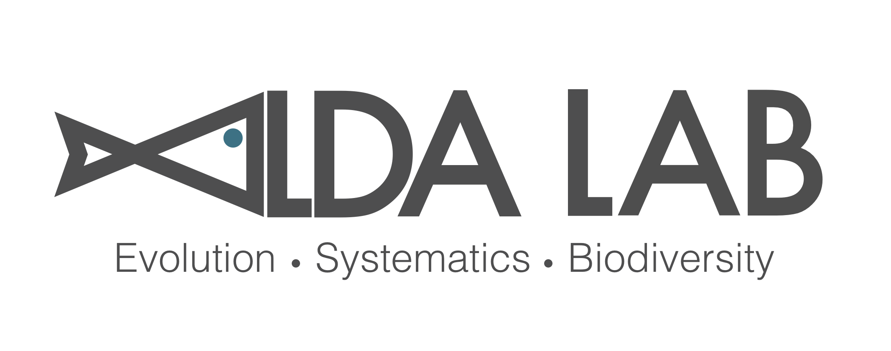
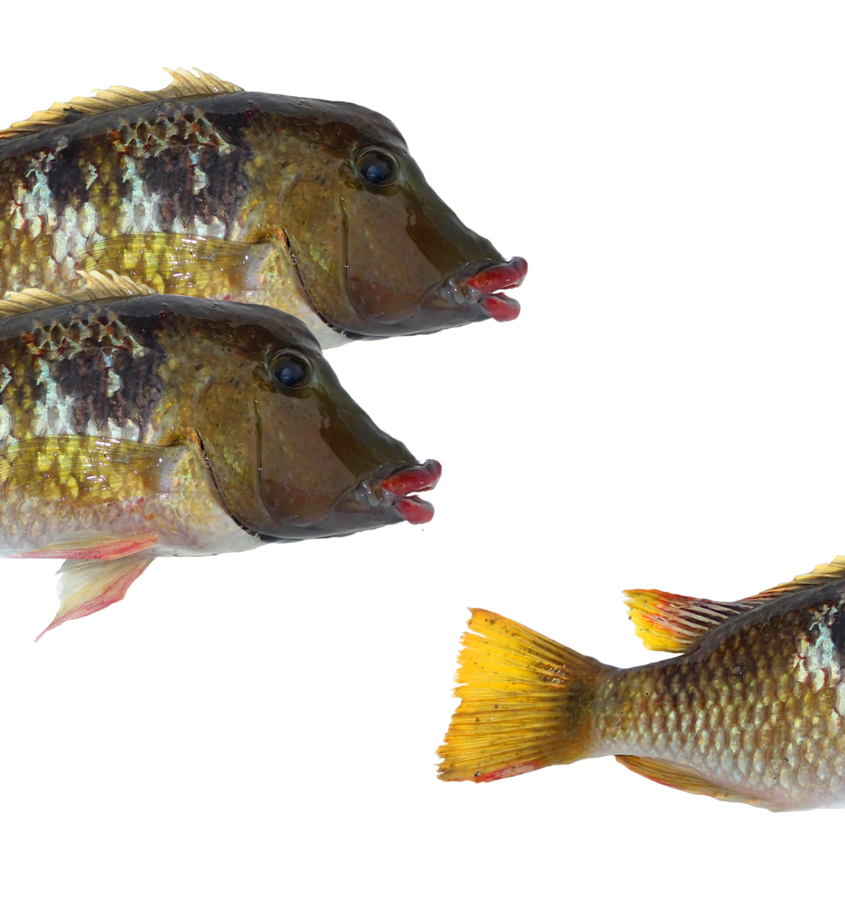

# Welcome to the Fernando Alda Lab

Evolutionary Biology • Freshwater Systems • Microbiomes

[Research](research.qmd) | [Join](join.qmd) | [Publications](publications.qmd)

---

## About Our Lab

We study biodiversity, species invasions, and microbial communities in freshwater ecosystems.
=======
title: ""
format:
   html:
      page-layout: full
page-footer:
  right: "This page is built with [Quarto](https://quarto.org/), with theme from [vetiver](https://github.com/rstudio/vetiver.rstudio.com)"

---

::: {.text-center}
{width=100%}

### Welcome to the Alda Lab!
:::

 

::: {.columns}

::: {.column width="60%"}
#### Our lab seeks to understand the **processes that generate and shape biodiversity**, focusing on the genomics and evolution of freshwater fishes.
 
#### See the [Research](research.qmd) page to learn more about our work.
 
 
#### If you are interested in [joining](join.qmd) the lab or have any questions, feel free to [get in touch](contact.qmd)!
:::

::: {.column width="40%"}
{width=100%}
:::
:::

  

  

::: {.text-center}
{width=80%}
:::
