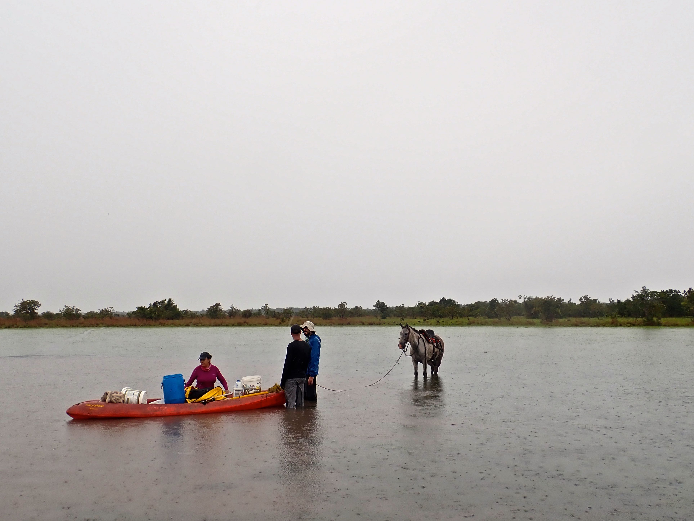

{width=100% style="height: 320px; object-fit: cover;   object-position:bottom;"}

### Interested in joining the lab?

We are seeking motivated, collaborative, and dynamic individuals to join the lab, including postdoctoral researchers, graduate students (master’s or Ph.D.), and undergraduates. We welcome those interested in evolutionary biology, systematics, population genomics, and freshwater biodiversity.

If you are curious about these topics, have your own ideas, or want to propose a project, we encourage you to [get in touch!](contact.qmd).