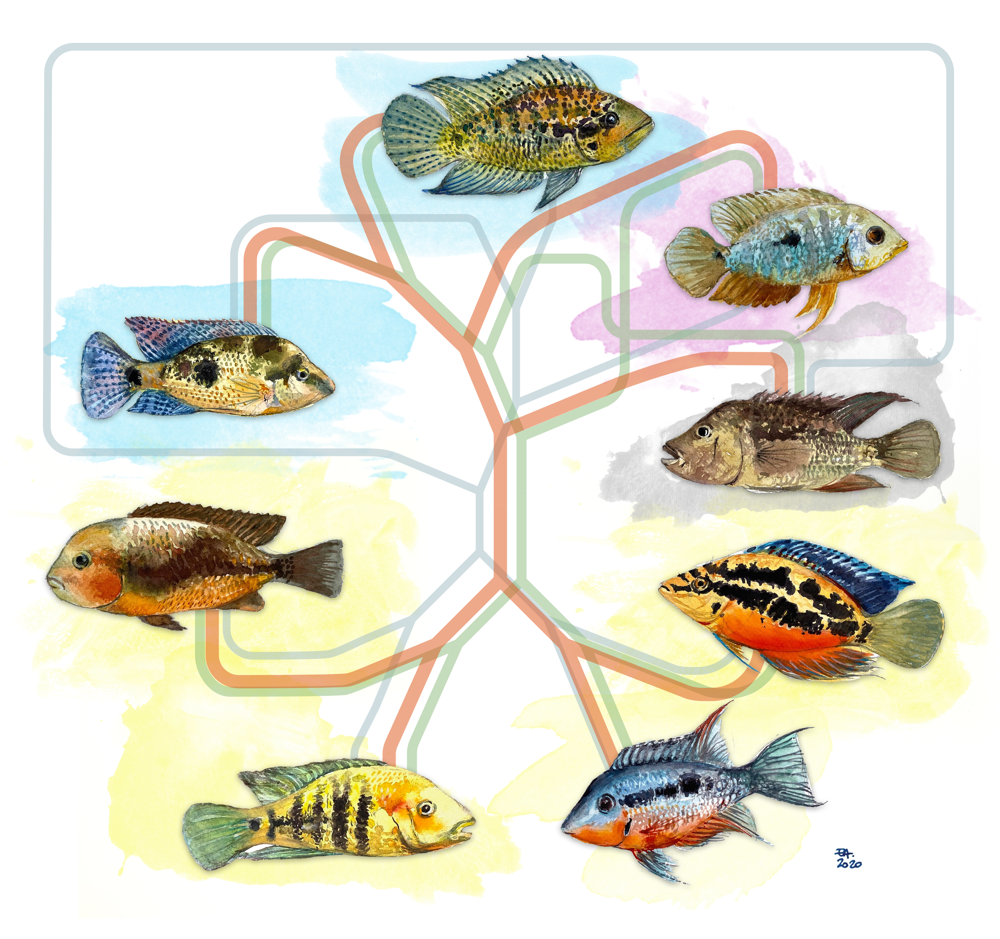

## Phylogenomics: Data, Methods, and Inference {#phylogenomics}

:::{.columns}

:::{.column width="50%"}
#### Phylogenomic studies continue to face challenges in developing computational approaches that scale with the volume of data generated by high-throughput sequencing technologies. As a result, researchers often rely on reduced-representation datasets (e.g., RADseq, exon capture, ultraconserved elements, anchored enrichment). Our work focuses on evaluating the power and limitations of these genomic approaches to determine which types of data and analytical strategies yield the most accurate and consistent estimates of species trees.
:::

:::{.column width="50%"}
{width=90%}
:::
:::

:::{.columns}

:::{.column width="50%"}
#### Our results show that filtering loci based on their phylogenetic informativeness across specific time slices reduces gene tree heterogeneity and improves species tree support more effectively than commonly used summary statistics. We also find that, in some scenarios, exon datasets provide higher phylogenetic signal but exhibit greater locus heterogeneity, potentially leading to systematic biases. In contrast, ultraconserved elements tend to be less informative overall but display greater homogeneity across loci. These differences can substantially influence both the evolutionary hypotheses inferred and their downstream interpretation.

#### Such comparative analyses are particularly relevant in the era of whole-genome sequencing, where decisions about data selection and integration are critical. Ultimately, our goal is to assess whether all genomic data types are equally suitable for addressing the diverse questions posed in phylogenomic systematics.
:::

:::{.column width="50%"}
GBE.Fig.png){width=90%}
:::
:::
---

####  **Representative publications:**
::: {.text-center}

:::{.columns}

:::{.column width="33%"}
GBE.Comparing ultraconserved elements and exons for phylogenomic analysis of Middle American Cichlids.png){width=100%} [PDF](pdfs/Aldaetal(2021)GBE.Comparing ultraconserved elements and exons for phylogenomic analysis of Middle American Cichlids.pdf)
:::

:::{.column width="33%"}
Copeia.A target enrichment bait set for studying relationships among ostariophysan fishes.png){width=100%} [PDF](pdfs/Fairclothetal(2020)Copeia.A target enrichment bait set for studying relationships among ostariophysan fishes.pdf)
:::

:::{.column width="33%"}
SystBiol.Resolving deep nodes in an ancient radiation of neotropical fishes in the presence of conflicting signals from ILS.png){width=100%} [PDF](pdfs/Aldaetal(2019)SystBiol.Resolving deep nodes in an ancient radiation of neotropical fishes in the presence of conflicting signals from ILS.pdf)
:::
:::
:::

---

Go back to the main [Research](research.qmd) page.
