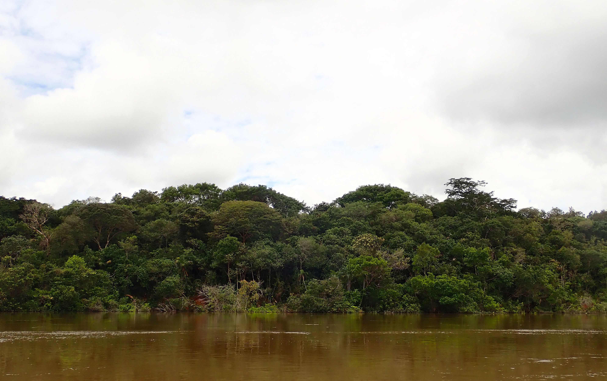
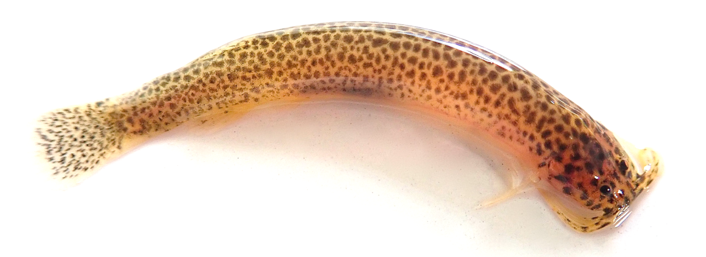
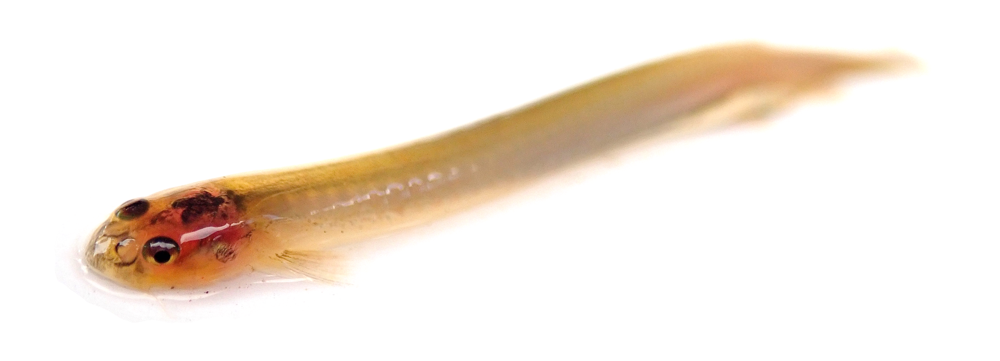

{width=100% style="height: 340px; object-fit: cover;   object-position:bottom;"}

## Articles
:::{.hanging-indent}
57\.  **Alda, F.**, Alter, S. E., Kurata, N. P., Chakrabarty, P., & Stiassny, M. L. J. (2025). Phylogenomic and population genomic analyses of ultraconserved elements reveal deep coalescence and introgression shaped diversification patterns in lamprologine cichlids of the Congo River. *Systematic Biology*, 74(4), 600–621. [doi:10.1093/sysbio/syaf032](https://doi.org/10.1093/sysbio/syaf032) &nbsp;&nbsp;&nbsp;&nbsp;&nbsp;&nbsp;&nbsp;[<i class="fa-solid fa-file-pdf"></i>](pdfs/Aldaetal(2025)SystBiol.Phylogenomic and population genomic analyses of lamprologine cichlids of the Congo River.pdf) &nbsp;&nbsp;&nbsp;&nbsp;&nbsp;[<i class="fa-solid fa-database"></i>](https://doi.org/10.5061/dryad.8931zcs13)  

56\.  **Alda, F.**, Mendoza-Franco, E. F., Hanson-Regan, W., Reina, R. G., Bermingham, E., & Torchin, M. E. (2025). Geography is a stronger predictor of diversification of monogenean parasites (Platyhelminthes) than host relatedness in characin fishes of Middle America. *PLoS ONE*, 20(4), e0316974. [doi:10.1371/journal.pone.0316974](https://doi.org/10.1371/journal.pone.0316974) &nbsp;&nbsp;&nbsp;&nbsp;&nbsp;&nbsp;&nbsp;[<i class="fa-solid fa-file-pdf"></i>](pdfs/Aldaetal(2025)PLoSONE.Geography is a stronger predictor of diversification of monogenean parasites than host relatedness in characin fishes of Middle America.pdf)

55\.  Hanson‐Regan, W., Leasi, F., & **Alda, F.** (2025). Geographical, ecological, and genetic drivers of gut microbial diversity in native and invasive minnows (Leuciscidae: *Cyprinella*). *Molecular Ecology*, 34(18), e70011. [doi:10.1111/mec.70011](https://doi.org/10.1111/mec.70011) &nbsp;&nbsp;&nbsp;&nbsp;&nbsp;&nbsp;&nbsp;[<i class="fa-solid fa-file-pdf"></i>](pdfs/Hanson-Reganetal(2025)MolEcol.Drivers of Gut Microbial Diversity in Native and Invasive Minnows.pdf)

54\.  Jimenez, S. M., Kurata, N. P., Stiassny, M. L. J., Alter, S. E., Chakrabarty, P., & **Alda, F.** (2025). Novel complete mitochondrial genomes of eight riverine *Lamprologus* species (Actinopterygii, Cichlidae) suggest in-situ speciation of the blind cichlid *L. Lethops* in the lower Congo River. *Mitochondrial DNA Part B*, 10(7), 595–601. [doi:10.1080/23802359.2025.2519212](https://doi.org/10.1080/23802359.2025.2519212) &nbsp;&nbsp;&nbsp;&nbsp;&nbsp;&nbsp;&nbsp;[<i class="fa-solid fa-file-pdf"></i>](pdfs/Jimenezetal(2025)MtDNAPartB.Novel complete mitochondrial genomes of eight riverine Lamprologus species  Actinopterygii  Cichlidae  suggest in-situ speciation of the blind cichlid.pdf) &nbsp;&nbsp;&nbsp;&nbsp;&nbsp;[<i class="fa-solid fa-database"></i>](https://doi.org/10.5281/zenodo.11442789)

53\.  Saltonstall, K., Collin, R., Aguilar, C., **Alda, F.**, Baldrich-Mora, L. M., Bravo, V., Castillo, M. F., Castro, S., De León, L. F., Díaz-Ferguson, E., Garcés, H. A., Gómez, E., González, R. G., González-Torres, M. A., Guzman, H. M., Hiller, A., Ibáñez, R., Jaramillo, C., Kaiser, K. L., … Castellanos-Galindo, G. (2025). A DNA barcode dataset for the aquatic fauna of the Panama Canal: Novel resources for detecting faunal change in the Neotropics. *Data*, 10(7), 108. [doi:10.3390/data10070108](https://doi.org/10.3390/data10070108) &nbsp;&nbsp;&nbsp;&nbsp;&nbsp;&nbsp;&nbsp;[<i class="fa-solid fa-file-pdf"></i>](pdfs/Saltonstalletal(2025)Data.A DNA barcode dataset for the aquatic fauna of the Panama Canal.pdf) &nbsp;&nbsp;&nbsp;&nbsp;&nbsp;[<i class="fa-solid fa-database"></i>](https://doi.org/10.25573/data.28899749)

52\.  De La Hera, I., **Alda, F.**, Ancin, L., Barba, E., Butroe Jauregi, J., Castro, A., Cevidanes, A., Galicia, D., Gosá, A., Elosegi, A., Herrero-Jáuregui, C., Hilario, A., Ibáñez, R., Leorri, E., Martín, B., Olariaga, I., Torres-Sánchez, M., & Webster, B. (2024). Munibe cumple 75 años: Una visión desde la sección de ciencias naturales. Munibe Ciencias Naturales. *Munibe*, 72, 7-19. [doi:10.21630/mcn.2024.72.13](https://doi.org/10.21630/mcn.2024.72.13) &nbsp;&nbsp;&nbsp;&nbsp;&nbsp;&nbsp;&nbsp;[<i class="fa-solid fa-file-pdf"></i>](pdfs/delaHeraetal(2024)Munibe.Munibe cumple 75 años. Una visión desde la sección de ciencias naturales.pdf)

51\.  Domínguez, J. C., **Alda, F.**, Calero-Riestra, M., Olea, P. P., Martínez-Padilla, J., Herranz, J., Oñate, J. J., Santamaría, A., Viñuela, J., García, J. T. (2023) Genetic footprints of a rapid and large-scale range expansion: the case of cyclic common vole in Spain. *Heredity*, 130, 381-393. [doi:10.1038/s41437-023-00613-w](https://doi.org/10.1038/s41437-023-00613-w) &nbsp;&nbsp;&nbsp;&nbsp;&nbsp;&nbsp;&nbsp;[<i class="fa-solid fa-file-pdf"></i>](pdfs/Domínguezetal(2023)Heredity.Genetic footprints of a rapid and large-scale range expansion. The case of cyclic common vole in Spain.pdf)

50\.  Elías, D. J., McMahan, C. D., **Alda, F.**, García-Alzate, C., Hart, P. B., & Chakrabarty, P. (2023). Phylogenomics of trans-Andean tetras of the genus *Hyphessobrycon* Durbin 1908 (Stethaprioninae: Characidae) and colonization patterns of Middle America. *PLoS ONE*, 18(1), e0279924. [doi:10.1371/journal.pone.0279924](https://doi.org/10.1371/journal.pone.0279924) &nbsp;&nbsp;&nbsp;&nbsp;&nbsp;&nbsp;&nbsp;[<i class="fa-solid fa-file-pdf"></i>](pdfs/Elíasetal(2023)PLoSOne.Phylogenomics of trans-Andean tetras of the genus Hyphessobrycon and colonization patterns of Middle America.pdf)

49\.  Snead, A., **Alda, F.** 2022. Time-series sequences for evolutionary inferences. *Integrative and Comparative Biology* 62: 1771-1783. [doi:10.1093/icb/icac146](https://doi.org/10.1093/icb/icac146) &nbsp;&nbsp;&nbsp;&nbsp;&nbsp;&nbsp;&nbsp;[<i class="fa-solid fa-file-pdf"></i>](pdfs/Snead&Alda(2022)IntCompBiol.Time-series sequences for evolutionary inferences.pdf)

48\.  Hart, P. B., Arnold, R. J., **Alda, F.**, Pietsch, T. W., Kenaley, C. P., Hutchinson, D., Chakrabarty, P. (2022). The evolutionary relationships of anglerfishes (Lophiiformes) reconstructed using ultraconserved elements. *Molecular Phylogenetics and Evolution*, 171, 107459. [doi:10.1016/j.ympev.2022.107459](https://doi.org/10.1016/j.ympev.2022.107459) &nbsp;&nbsp;&nbsp;&nbsp;&nbsp;&nbsp;&nbsp;[<i class="fa-solid fa-file-pdf"></i>](pdfs/Hartetal(2022)MPE.Evolutionary relationships of anglerfishes Lophiiformes.pdf) &nbsp;&nbsp;&nbsp;&nbsp;&nbsp;[<i class="fa-solid fa-database"></i>](https://datadryad.org/dataset/doi:10.5061/dryad.rbnzs7hd1)

47\.  **Alda, F.**, Ludt, W. B., Elías, D. J., McMahan, C. D., & Chakrabarty, P. (2021). Comparing ultraconserved elements and exons for phylogenomic analyses of Middle American cichlids: When data agree to disagree. *Genome Biology and Evolution*, 13(8), evab161. [doi:10.1093/gbe/evab161](https://doi.org/10.1093/gbe/evab161) &nbsp;&nbsp;&nbsp;&nbsp;&nbsp;&nbsp;&nbsp;[<i class="fa-solid fa-file-pdf"></i>](pdfs/Aldaetal(2021)GBE.Comparing ultraconserved elements and exons for phylogenomic analysis of Middle American Cichlids.pdf)  &nbsp;&nbsp;&nbsp;&nbsp;&nbsp;[<i class="fa-solid fa-database"></i>](https://doi.org/10.5061/dryad.1rn8pk0sh)

46\.  García, J., Morán‐Ordóñez, A., García, J. T., Calero‐Riestra, M., **Alda, F.**, Sanz, M., Suárez-Seoane, S. (2021). Current landscape attributes and landscape stability in breeding grounds explain genetic differentiation in a long‐distance migratory bird. *Animal Conservation*, 24: 120-134. [doi:10.1093/gbe/evab161](https://doi.org/10.1093/gbe/evab161) &nbsp;&nbsp;&nbsp;&nbsp;&nbsp;&nbsp;&nbsp;[<i class="fa-solid fa-file-pdf"></i>](pdfs/Garcíaetal(2021)AnimalConservation.Current landscape attributes and landscape stability in breeding grounds explain genetic differentiation in a long distance migratory bird.pdf)

45\.  Rossi, N. A., Menchaca-rodriguez, A., Antelo, R., Wilson, B., Mclaren, K., Mazzotti, F., Crespo, R., Wasilewski, J., **Alda, F.**, Doadrio, I., Barrios, T. R., Hekkala, E., Alonso-Tabet, M., Alonso-Giménez, Y., Lopez, M., Espinosa-Lopez, G., Burgess, J., Thorbjarnarson, J. B., Ginsberg, J. R., … Amato, G. (2020). High levels of population genetic differentiation in the American crocodile *(Crocodylus acutus)*. *PLoS ONE*, 15(7), e0235288. [doi:10.21203/rs.2.16265/v1](https://doi.org/10.21203/rs.2.16265/v1) &nbsp;&nbsp;&nbsp;&nbsp;&nbsp;&nbsp;&nbsp;[<i class="fa-solid fa-file-pdf"></i>](pdfs/Rossietal(2020)PLoSOne.High levels of population genetic differentiation in the American crocodile Crocodylus acutus.pdf)

44\.  García, J. T., Domínguez-Villaseñor, J., **Alda, F.**, Calero-Riestra, M., Pérez Olea, P., Fargallo, J. A., Martínez-Padilla, J., Herranz, J., Oñate, J. J., Santamaría, A., Motro, Y., Attie, C., Bretagnolle, V., Delibes, J., & Viñuela, J. (2020). A complex scenario of glacial survival in Mediterranean and continental refugia of a temperate continental vole species *(Microtus arvalis)* in Europe. *Journal of Zoological Systematics and Evolutionary Research*, 58(1), 459–474. [doi:10.1111/jzs.12323](https://doi.org/10.1111/jzs.12323) &nbsp;&nbsp;&nbsp;&nbsp;&nbsp;&nbsp;&nbsp;[<i class="fa-solid fa-file-pdf"></i>](pdfs/Garcíaetal(2020)JZoolSystEvolRes.Complex scenario of glacial survival in Mediterranean and continental refugia of a temperate continental vole species Microtus arvalis.pdf)

43\.  Faircloth, B. C., **Alda, F.**, Hoekzema, K., Burns, M. D., Oliveira, C., Albert, J. S., Melo, B. F., Ochoa, L. E., Roxo, F. F., Chakrabarty, P., Sidlauskas, B. L., & Alfaro, M. E. (2020). A target enrichment bait set for studying relationships among ostariophysan fishes. *Copeia*, 108(1), 47–60. [doi:10.1643/CG-18-139](https://doi.org/10.1643/CG-18-139) &nbsp;&nbsp;&nbsp;&nbsp;&nbsp;&nbsp;&nbsp;[<i class="fa-solid fa-file-pdf"></i>](pdfs/Fairclothetal(2020)Copeia.A target enrichment bait set for studying relationships among ostariophysan fishes.pdf) &nbsp;&nbsp;&nbsp;&nbsp;&nbsp;[<i class="fa-solid fa-database"></i>](https://doi.org/10.6084/m9.figshare.7144199.v2)

42\.  Moody, E. K., **Alda, F.**, Capps, K. A., Puebla, O., & Turner, B. L. (2019). Trophic trait evolution explains variation in nutrient excretion stoichiometry among Panamanian armored catfishes (Loricariidae). *Diversity*, 11(6), 88–88. [doi:10.3390/d11060088)](https://doi.org/10.3390/d11060088)&nbsp;&nbsp;&nbsp;&nbsp;&nbsp;&nbsp;&nbsp;[<i class="fa-solid fa-file-pdf"></i>](pdfs/Moodyetal(2019)Diversity.Trophic trait evolution Loricariidae.pdf)

41\.  **Alda, F.**, Tagliacollo, V. A., Bernt, M. J., Waltz, B. T., Ludt, W. B., Faircloth, B. C., Alfaro, M. E., Albert, J. S., & Chakrabarty, P. (2019). Resolving deep nodes in an ancient radiation of neotropical fishes in the presence of conflicting signals from incomplete lineage sorting. *Systematic Biology*, 68(4), 573–593. [doi:10.1093/sysbio/syy085](https://doi.org/10.1093/sysbio/syy085) &nbsp;&nbsp;&nbsp;&nbsp;&nbsp;&nbsp;&nbsp;[<i class="fa-solid fa-file-pdf"></i>](pdfs/Aldaetal(2019)SystBiol.Resolving deep nodes in an ancient radiation of neotropical fishes in the presence of conflicting signals from ILS.pdf)  &nbsp;&nbsp;&nbsp;&nbsp;&nbsp;[<i class="fa-solid fa-database"></i>](https://doi.org/10.5061/dryad.k57430s)

40\.  **Schönhuth, S.**, Gagne, R., Alda, F., Neely, D., Mayden, R., & Blum, M. (2018). Phylogeography of the widespread creek chub *Semotilus atromaculatus* (Cypriniformes: Leuciscidae). *Journal of Fish Biology*, 93(5), 778–791.  [doi:10.1111/jfb.13778](https://doi.org/10.1111/jfb.13778) &nbsp;&nbsp;&nbsp;&nbsp;&nbsp;&nbsp;&nbsp;[<i class="fa-solid fa-file-pdf"></i>](pdfs/Schönhuthetal(2018)JFB.Phylogeography of the widespread creek chub Semotilus atromaculatus.pdf)

39\.  **Alda, F.**, Adams, A. J., Chakrabarty, P., & McMillan, W. O. (2018). Mitogenomic divergence between three pairs of putative geminate fishes from Panama. *Mitochondrial DNA Part B: Resources*, 3(1), 1–5. [doi:10.1080/23802359.2017.1413288](https://doi.org/10.1080/23802359.2017.1413288) &nbsp;&nbsp;&nbsp;&nbsp;&nbsp;&nbsp;&nbsp;[<i class="fa-solid fa-file-pdf"></i>](pdfs/Aldaetal(2018)mtDNAB.Mitogenomic divergence between three pairs of putative geminate fishes from Panama.pdf)

38\.  Burress, E. D., **Alda, F.**, Duarte, A., Loureiro, M., Armbruster, J. W., & Chakrabarty, P. (2018). Phylogenomics of pike cichlids (Cichlidae: *Crenicichla*): The rapid ecological speciation of an incipient species flock. *Journal of Evolutionary Biology*, 31(1), 14–30. [doi:10.1111/jeb.13196](https://doi.org/10.1111/jeb.13196) &nbsp;&nbsp;&nbsp;&nbsp;&nbsp;&nbsp;&nbsp;[<i class="fa-solid fa-file-pdf"></i>](pdfs/Burressetal(2018)JEB.Phylogenomics of pike cichlids Crenicichla the rapid ecological speciation of an incipient species flock.pdf) &nbsp;&nbsp;&nbsp;&nbsp;&nbsp;[<i class="fa-solid fa-database"></i>](https://doi.org/10.5061/dryad.7qs13)

37\.  Gagne, R. B., Sprehn, C. G., **Alda, F.**, Mcintyre, P. B., Gilliam, J. F., & Blum, M. J. (2017). Invasion of the Hawaiian Islands by a parasite infecting imperiled stream fishes. *Ecography*, 41(3), 528–539. [doi:10.1111/ecog.02855](https://doi.org/10.1111/ecog.02855) &nbsp;&nbsp;&nbsp;&nbsp;&nbsp;&nbsp;&nbsp;[<i class="fa-solid fa-file-pdf"></i>](pdfs/Gagneetal(2017)Ecography.Invasion of the Hawaiian Islands by a parasite infecting imperiled stream fishes.pdf) &nbsp;&nbsp;&nbsp;&nbsp;&nbsp;[<i class="fa-solid fa-database"></i>](https://doi.org/10.5061/dryad.b9h54)

36\.  **Alda, F.**, Adams, A. J., McMillan, W. O., Chakrabarty, P. (2017). Complete mitochondrial genomes of three Neotropical sleeper gobies: *Eleotris amblyopsis*, *Eleotris picta* and *Hemieleotris latifasciata*. *Mitochondrial DNA Part B*, 2, 747-750. [doi:10.1080/23802359.2017.1390412](https://doi.org/10.1080/23802359.2017.1390412) &nbsp;&nbsp;&nbsp;&nbsp;&nbsp;&nbsp;&nbsp;[<i class="fa-solid fa-file-pdf"></i>](pdfs/Aldaeta(2017)MtDNAB.Complete mitochondrial genomes of three Neotropical sleeper gobies Eleotris amblyopsis E picta and Hemieleotris latifasciata Gobiiformes Eleotridae.pdf)

35\.  Moody, K. N., Gagne, R. B., Heim-Ballew, H., **Alda, F.**, Hain, E. F., Lisi, P. J., Walter, R. P., Higashi, G. R., Hogan, J. D., McIntyre, P. B., Gilliam, J. F., & Blum, M. J. (2017). Invasion hotspots and ecological saturation of streams across the Hawaiian archipelago. *Cybium*, 41(2), 528–539. [doi:10.26028/cybium/2017-412-006](https://doi.org/10.26028/cybium/2017-412-006)&nbsp;&nbsp;&nbsp;&nbsp;&nbsp;&nbsp;&nbsp;[<i class="fa-solid fa-file-pdf"></i>](pdfs/Moodyetal(2017)Cybium.Invasion hotsposts and ecological saturation of streams across the Hawaiian archipelago.pdf)

34\.  Chakrabarty, P., Faircloth, B. C., **Alda, F.**, Ludt, W. B., McMahan, C. D., Near, T. J., Dornburg, A., Albert, J. S., Arroyave, J., Stiassny, M. L. J., Sorenson, L., & Alfaro, M. E. (2017). Phylogenomic systematics of Ostariophysan fishes: Ultraconserved elements support the surprising non-monophyly of Characiformes. *Systematic Biology*, 66(6), 881–895. [doi:10.1093/sysbio/syx038](https://doi.org/10.1093/sysbio/syx038) &nbsp;&nbsp;&nbsp;&nbsp;&nbsp;&nbsp;&nbsp;[<i class="fa-solid fa-file-pdf"></i>](pdfs/Chakrabartyetal(2017)SystBiol.Phylogenomic systematics of Ostariophysan fishes.pdf) &nbsp;&nbsp;&nbsp;&nbsp;&nbsp;[<i class="fa-solid fa-database"></i>](https://doi.org/10.5061/dryad.n9g60)

33\.  Peterson, A. C., Ghersi, B. M., **Alda, F.**, Firth, C., Frye, M. J., Bai, Y., Osikowicz, L. M., Riegel, C., Lipkin, W. I., Kosoy, M. Y., & Blum, M. J. (2017). Rodent-borne *Bartonella* infection varies according to host species within and among cities. *EcoHealth*, 14(4), 771–782. [doi:10.1007/s10393-017-1291-4](https://doi.org/10.1007/s10393-017-1291-4) &nbsp;&nbsp;&nbsp;&nbsp;&nbsp;&nbsp;&nbsp;[<i class="fa-solid fa-file-pdf"></i>](pdfs/Petersonetal(2017)EcoHealth.Rodent-borne Bartonella infection varies according to host.pdf)

32\.  Le Pendu, J., Abrantes, J., Bertagnoli, S., Guitton, J.-S., Le Gall-Reculé, G., Lopes, A. M., Marchandeau, S., **Alda, F.**, Almeida, T., Célio, A. P., Bárcena, J., Burmakina, G., Blanco, E., Calvete, C., Cavadini, P., Cooke, B., Dalton, K., Mateos, M. D., Deptula, W., … Esteves, P. (2017). Proposal for a unified classification system and nomenclature of lagoviruses. *Journal of General Virology*, 98(7), 1658–1666. [doi:10.1099/jgv.0.000840](https://doi.org/10.1099/jgv.0.000840) &nbsp;&nbsp;&nbsp;&nbsp;&nbsp;&nbsp;&nbsp;[<i class="fa-solid fa-file-pdf"></i>](pdfs/LePenduetal(2017)JGenVirol.Proposal for a unified classification of Lagoviruses.pdf)

31\.  **Alda, F.**, Gagne, R. B., Walter, R. P., Hogan, J. D., Moody, K. N., Zink, F., Mcintyre, P. B., Gilliam, J. F., & Blum, M. J. (2016). Colonization and demographic expansion of freshwater fauna across the Hawaiian Archipelago. *Journal of Evolutionary Biology*, 29(10), 2054–2069. [doi:10.1111/jeb.12929](https://doi.org/10.1111/jeb.12929) &nbsp;&nbsp;&nbsp;&nbsp;&nbsp;&nbsp;&nbsp;[<i class="fa-solid fa-file-pdf"></i>](pdfs/Aldaetal(2016)JEB.Colonization and expansion Hawaii freshwater fauna.pdf) &nbsp;&nbsp;&nbsp;&nbsp;&nbsp;[<i class="fa-solid fa-database"></i>](https://doi.org/10.5061/dryad.n21f4)

30\.  Picq, S., **Alda, F.**, Bermingham, E., & Krahe, R. (2016). Drift-driven evolution of electric signals in a Neotropical knifefish. *Evolution*, 70(9), 2134–2144. [doi:10.1111/evo.13010] (https://doi.org/10.1111/evo.13010) &nbsp;&nbsp;&nbsp;&nbsp;&nbsp;&nbsp;&nbsp;[<i class="fa-solid fa-file-pdf"></i>](pdfs/Picqetal(2016)Evolution.Drift-driven evolution of electric signals in a Neotropical knifefish.pdf)

29\.  Strobel, H. M., **Alda, F.**, Sprehn, C. G., Blum, M. J., & Heins, D. C. (2016). Geographic and host-mediated population genetic structure in a cestode parasite of the three-spined stickleback. *Biological Journal of the Linnean Society*, 119(2), 381–396.[doi:10.1111/bij.12826](https://doi.org/10.1111/bij.12826) &nbsp;&nbsp;&nbsp;&nbsp;&nbsp;&nbsp;&nbsp;[<i class="fa-solid fa-file-pdf"></i>](pdfs/Strobeletal(2016)BJLS.Geographic and host mediates genetic structure Schistocephalus solidus.pdf) &nbsp;&nbsp;&nbsp;&nbsp;&nbsp;[<i class="fa-solid fa-database"></i>](https://doi.org/10.5061/dryad.b1c06)

28\.  Galván-Quesada, S., Doadrio, I., **Alda, F.**, Perdices, A., Reina, R. G., García Varela, M., Hernández, N., Mendoza, A. C., Bermingham, E., & Domínguez-Domínguez, O. (2016). Molecular phylogeny and biogeography of the amphidromous fish genus *Dormitator* Gill 1861 (Teleostei: Eleotridae). *PLoS ONE*, 11(4), e0153538–e0153538.[doi:10.1371/journal.pone.0153538](https://doi.org/10.1371/journal.pone.0153538) &nbsp;&nbsp;&nbsp;&nbsp;&nbsp;&nbsp;&nbsp;[<i class="fa-solid fa-file-pdf"></i>](pdfs/Galván-Quesadaetal(2016)PLoSOne.Molecular Phylogeny and Biogeography of the amphidromous fish genus Dormitator.pdf)

27\.  Glotzbecker, G. J., **Alda, F.**, Broughton, R. E., Neely, D. A., Mayden, R. L., & Blum, M. J. (2016). Geographic independence and phylogenetic diversity of red shiner introductions. *Conservation Genetics*, 17(4), 795–809.[doi:10.1007/s10592-016-0822-9](https://doi.org/10.1007/s10592-016-0822-9) &nbsp;&nbsp;&nbsp;&nbsp;&nbsp;&nbsp;&nbsp;[<i class="fa-solid fa-file-pdf"></i>](pdfs/Glotzbeckeretal(2016)ConGen.Geographic independece and diversity of red shiner introductions.pdf)

26\.  Rossi Lafferriere, N. A., Antelo, R., **Alda, F.**, Mårtensson, D., Hailer, F., Castroviejo-Fisher, S., Ayarzagüena, J., Ginsberg, J. R., Castroviejo, J., Doadrio, I., Vilá, C., & Amato, G. (2016). Multiple paternity in a reintroduced population of the Orinoco crocodile (*Crocodylus intermedius*) at the El Frío Biological Station, Venezuela. *PLoS ONE*, 11(3), e0150245–e0150245.[doi:10.1371/journal.pone.0150245](https://doi.org/10.1371/journal.pone.0150245) &nbsp;&nbsp;&nbsp;&nbsp;&nbsp;&nbsp;&nbsp;[<i class="fa-solid fa-file-pdf"></i>](pdfs/Rossi Lafferriereetal.(2016)PLoSOne.Multiple paternity in a reintroduced population of the Orinoco crocodile Crocodylus intermedius.pdf)

25\.  Rocha, G., **Alda, F.**, Pagés, A., & Merchán, T. (2017). Experimental transmission of rabbit haemorrhagic disease virus (RHDV) from rabbit to wild mice (*Mus spretus* and *Apodemus sylvaticus*) under laboratory conditions. *Infection, Genetics and Evolution*, 47, 94–98. [doi:10.1016/j.meegid.2016.11.016](https://doi.org/10.1016/j.meegid.2016.11.016) &nbsp;&nbsp;&nbsp;&nbsp;&nbsp;&nbsp;&nbsp;[<i class="fa-solid fa-file-pdf"></i>](pdfs/Rochaetal(2017)InfectionGeneticsEvol.Experimental transmission of rabbit haemorrhagic disease virus (RHDV) from rabbit to wild mice (Mus spretus and Apodemus sylvaticus) under laboratory conditions.pdf)

24\.  Bagley, J. C., **Alda, F.**, Breitman, M. F., Bermingham, E., Van Den Berghe, E. P., & Johnson, J. B. (2015). Assessing species boundaries using multilocus species delimitation in a morphologically conserved group of Neotropical freshwater fishes, the *Poecilia sphenops* species complex (Poeciliidae). *PLoS ONE*, 10(4), e0121139. [doi:10.1371/journal.pone.0121139](https://doi.org/10.1371/journal.pone.0121139) &nbsp;&nbsp;&nbsp;&nbsp;&nbsp;&nbsp;&nbsp;[<i class="fa-solid fa-file-pdf"></i>](pdfs/Bagleyetal(2015)PLoSONE.Assessing species delimitation in a morphologically conserved group of neotropical freshwater fishes the Poecilia sphenops species complex.pdf) &nbsp;&nbsp;&nbsp;&nbsp;&nbsp;[<i class="fa-solid fa-database"></i>](https://doi.org/10.5061/dryad.m1g3v)

23\.  Calvo, M., **Alda, F.**, Oliverio, M., Templado, J., & Machordom, A. (2015). Surviving the Messinian Salinity Crisis? Divergence patterns in the genus *Dendropoma* (Gastropoda: Vermetidae) in the Mediterranean Sea. *Molecular Phylogenetics and Evolution*, 91, 17–26. [doi:10.1016/j.ympev.2015.05.004](https://doi.org/10.1016/j.ympev.2015.05.004) &nbsp;&nbsp;&nbsp;&nbsp;&nbsp;&nbsp;&nbsp;[<i class="fa-solid fa-file-pdf"></i>](pdfs/Calvoetal(2015)MPE.Surviving the Messinian Salinity Crisis Divergence patterns Dendropoma.pdf)

22\.  Picq, S., **Alda, F.**, Krahe, R., & Bermingham, E. (2014). Miocene and Pliocene colonization of the Central American Isthmus by the weakly electric fish *Brachyhypopomus occidentalis* (Hypopomidae, Gymnotiformes). *Journal of Biogeography*, 41(8), 1520–1532. [doi:10.1111/jbi.12309](https://doi.org/10.1111/jbi.12309) &nbsp;&nbsp;&nbsp;&nbsp;&nbsp;&nbsp;&nbsp;[<i class="fa-solid fa-file-pdf"></i>](pdfs/Picqetal(2014)JBiogeo.Miocene and Pliocene colonization of the Central American Isthmus by the weakly electric fish Brachyhypopomus occidentalis.pdf)

21\.  **Alda, F.**, & Doadrio, I. (2014). Spatial genetic structure across a hybrid zone between European rabbit subspecies. *PeerJ*, 2, e582–e582. [doi:10.7717/peerj.582](https://doi.org/10.7717/peerj.582) &nbsp;&nbsp;&nbsp;&nbsp;&nbsp;&nbsp;&nbsp;[<i class="fa-solid fa-file-pdf"></i>](pdfs/Alda&Doadrio(2014)PeerJ.Spatial genetic structure hybrid zone of rabbit subspecies.pdf)

20\.  **Alda, F.**, Picq, S., León, L. F. de, González, R., Walz, H., Bermingham, E., & Krahe, R. (2013). First record of *Gymnotus henni* (Albert, Crampton and Maldonado, 2003) in Panama: Phylogenetic position and electric signal characterization. *Check List*, 9(3), 655–659. [doi: 10.15560/9.3.655](https://doi.org/10.15560/9.3.655) &nbsp;&nbsp;&nbsp;&nbsp;&nbsp;&nbsp;&nbsp;[<i class="fa-solid fa-file-pdf"></i>](pdfs/Aldaetal(2013)CheckList.First record Gymnotus henni in Panama.pdf)

19\.  **Alda, F.**, Reina, R. G., Doadrio, I., & Bermingham, E. (2013). Phylogeny and biogeography of the *Poecilia sphenops* species complex (Actinopterygii, Poeciliidae) in Central America. *Molecular Phylogenetics and Evolution*, 66(3), 1011–1026. [doi:10.1016/j.ympev.2012.12.012](https://doi.org/10.1016/j.ympev.2012.12.012) &nbsp;&nbsp;&nbsp;&nbsp;&nbsp;&nbsp;&nbsp;[<i class="fa-solid fa-file-pdf"></i>](pdfs/Aldaetal(2013)MPE.Phylogeny and biogeography Poecilia.pdf) &nbsp;&nbsp;&nbsp;&nbsp;&nbsp;&nbsp;&nbsp;[<i class="fa-solid fa-database"></i>](https://doi.org/10.5061/dryad.fb280)

18\.  **Alda, F.**, García, J., García, J. T., & Suárez-Seoane, S. (2013). Local genetic structure on breeding grounds of a long-distance migrant passerine: The bluethroat *(Luscinia svecica)* in Spain. *Journal of Heredity*, 104(1), 36–46. [doi:10.1093/jhered/ess071](https://doi.org/10.1093/jhered/ess071) &nbsp;&nbsp;&nbsp;&nbsp;&nbsp;&nbsp;&nbsp;[<i class="fa-solid fa-file-pdf"></i>](pdfs/Aldaetal(2013)JHered.Local genetic structure on breeding grounds of a long-distance migrant passerine- The bluethroat (Luscinia svecica) in Spain.pdf)

17\.  **Alda, F.**, González, M. A., Olea, P. P., Ena, V., Godinho, R., & Drovetski, S. V. (2013). Genetic diversity, structure and conservation of the endangered Cantabrian Capercaillie in a unique peripheral habitat. *European Journal of Wildlife Research*, 59(5), 719–728. [doi:10.1007/s10344-013-0727-6](https://doi.org/10.1007/s10344-013-0727-6) &nbsp;&nbsp;&nbsp;&nbsp;&nbsp;&nbsp;&nbsp;[<i class="fa-solid fa-file-pdf"></i>](pdfs/Aldaetal(2013)EJWR.Genetic diversity, structure and conservation of the endangered Cantabrian Capercaillie in a unique peripheral habitat.pdf)

16\.  **Alda, F.**, Ruiz-López, M. J., García, F. J., Gompper, M. E., Eggert, L. S., & García, J. T. (2013). Genetic evidence for multiple introduction events of raccoons *(Procyon lotor)* in Spain. *Biological Invasions*, 15(3), 687–698. [doi:10.1007/s10530-012-0318-6](https://doi.org/10.1007/s10530-012-0318-6) &nbsp;&nbsp;&nbsp;&nbsp;&nbsp;&nbsp;&nbsp;[<i class="fa-solid fa-file-pdf"></i>](pdfs/Aldaetal(2013)BiolInv.Genetic evidence for multiple introduction events of raccoons (Procyon lotor) in Spain.pdf)

15\.  Ornelas-García, C. P., **Alda, F.**, Díaz-Pardo, E., Gutiérrez-Hernández, A., & Doadrio, I. (2012). Genetic diversity shaped by historical and recent factors in the live-bearing twoline skiffia *Neotoca bilineata*. *Journal of Fish Biology*, 81(6), 1963–1984. [doi:10.1111/j.1095-8649.2012.03456.x](https://doi.org/10.1111/j.1095-8649.2012.03456.x) &nbsp;&nbsp;&nbsp;&nbsp;&nbsp;&nbsp;&nbsp;[<i class="fa-solid fa-file-pdf"></i>](pdfs/Ornelasetal(2013)PlosOne.Comparative phylogeographic analyses of threatened cloud forests of northern Mesoamerica.pdf)

14\.  Calero-Riestra, M., **Alda, F.**, Dávila, J. A., & García, J. T. (2012). Characterization of polymorphic microsatellite loci for the Tawny Pipit *Anthus campestris* and their utility in other steppe birds. *European Journal of Wildlife Research*, 58(1), 379–383.[doi:10.1007/s10344-011-0580-4](https://doi.org/10.1007/s10344-011-0580-4) &nbsp;&nbsp;&nbsp;&nbsp;&nbsp;&nbsp;&nbsp;[<i class="fa-solid fa-file-pdf"></i>](pdfs/Calero-Riestraetal(2012)EurJWildlRes.Characterization of polymorphic microsatellite loci for the Tawyny Pipit Anthus campestris.pdf)

13\.  Cabezas, P., **Alda, F.**, Macpherson, E., & Machordom, A. (2012). Genetic characterization of the endangered and endemic anchialine squat lobster *Munidopsis polymorpha* from Lanzarote (Canary Islands): Management implications. *ICES Journal of Marine Science*, 69(6), 1030–1037. [doi:10.1093/icesjms/fss062](https://doi.org/10.1093/icesjms/fss062) &nbsp;&nbsp;&nbsp;&nbsp;&nbsp;&nbsp;&nbsp;[<i class="fa-solid fa-file-pdf"></i>](pdfs/Cabezasetal(2012)ICESJMarineSci.Genetic characterization of the endangered and endemic anchialine squat lobster Munidopsis polymorpha from Lanzarote.pdf) &nbsp;&nbsp;&nbsp;&nbsp;&nbsp;&nbsp;&nbsp;[<i class="fa-solid fa-file-pdf"></i>](https://doi.org/10.5061/dryad.17s6621t)

12\.  García, J. T., García, F. J., **Alda, F.**, González, J. L., Aramburu, M. J., Cortés, Y., Prieto, B., Pliego, B., Pérez, M., Herrera, J., & García-Román, L. (2012). Recent invasion and status of the raccoon *(Procyon lotor)* in Spain. *Biological Invasions*, 14(7), 1305–1310. [doi:10.1007/s10530-011-0157-x](https://doi.org/10.1007/s10530-011-0157-x) &nbsp;&nbsp;&nbsp;&nbsp;&nbsp;&nbsp;&nbsp;[<i class="fa-solid fa-file-pdf"></i>](pdfs/Garcíaetal(2012)BiolInv.Recent invasion of raccoon in Spain.pdf)

11\.  Rodríguez, R., Ramírez, O., Valdiosera, C. E., García, N., **Alda, F.**, Madurell-Malapeira, J., Marmi, J., Doadrio, I., Willerslev, E., Götherström, A., Arsuaga, J. L., Thomas, M. G., Lalueza-Fox, C., & Dalén, L. (2011). 50,000 years of genetic uniformity in the critically endangered Iberian lynx. *Molecular Ecology*, 20(18), 3785–3795. [doi:10.1111/j.1365-294X.2011.05231.x](https://doi.org/10.1111/j.1365-294X.2011.05231.x) &nbsp;&nbsp;&nbsp;&nbsp;&nbsp;&nbsp;&nbsp;[<i class="fa-solid fa-file-pdf"></i>](pdfs/Rodriguezetal(2011)MolEcol.50000 years genetic uniformity iberian lynx.pdf)

10\.  Merchán, T., Rocha, G., **Alda, F.**, Silva, E., Thompson, G., Trucios, S. H. de, & Pagés, A. (2011). Detection of rabbit haemorrhagic disease virus (RHDV) in nonspecific vertebrate hosts sympatric to the European wild rabbit *(Oryctolagus cuniculus)*. *Infection, Genetics and Evolution*, 11(6), 1469–1474. [doi:10.1016/j.meegid.2011.05.001](https://doi.org/10.1016/j.meegid.2011.05.001) &nbsp;&nbsp;&nbsp;&nbsp;&nbsp;&nbsp;&nbsp;[<i class="fa-solid fa-file-pdf"></i>](pdfs/Merchánetal(2011)InfGenEvol.Detection RHDV in micromammals.pdf)

9\.  Garcia, J. T., **Alda, F.**, Terraube, J., Mougeot, F., Sternalski, A., Bretagnolle, V., & Arroyo, B. (2011). Demographic history, genetic structure and gene flow in a steppe-associated raptor species. *BMC Evolutionary Biology*, 11(1), 333. [doi:10.1186/1471-2148-11-333](https://doi.org/10.1186/1471-2148-11-333) &nbsp;&nbsp;&nbsp;&nbsp;&nbsp;&nbsp;&nbsp;[<i class="fa-solid fa-file-pdf"></i>](pdfs/Garcíaetal(2011)BMCEvolBiol.Demographic history genetic structure and gene flow in a steppe associated raptor species.pdf)

8\.  **Alda, F.**, Gaitero, T., Suárez, M., Merchán, T., Rocha, G., & Doadrio, I. (2010). Evolutionary history and molecular epidemiology of rabbit haemorrhagic disease virus in the Iberian Peninsula and Western Europe. *BMC Evolutionary Biology*, 10(1), 347–347. [doi:10.1186/1471-2148-10-347](https://doi.org/10.1186/1471-2148-10-347) &nbsp;&nbsp;&nbsp;&nbsp;&nbsp;&nbsp;&nbsp;[<i class="fa-solid fa-file-pdf"></i>](pdfs/Aldaetal(2010)BMCEvolBiol.Evolutionary history RHDV.pdf)

7\.  **Alda, F.**, Sastre, P., De La Cruz-Cardiel, P. J., & Doadrio, I. (2011). Population genetics of the endangered Cantabrian capercaillie in northern Spain. *Animal Conservation*, 14(3), 249–260. [doi:10.1111/j.1469-1795.2010.00425.x](https://doi.org/10.1111/j.1469-1795.2010.00425.x) &nbsp;&nbsp;&nbsp;&nbsp;&nbsp;&nbsp;&nbsp;[<i class="fa-solid fa-file-pdf"></i>](pdfs/Aldaetal(2011)AnimalCons.Population genetics of the endangered Cantabrian capercaillie in northern Spain.pdf)

6\.  Pedraza-Lara, C., **Alda, F.**, Carranza, S., & Doadrio, I. (2010). Mitochondrial DNA structure of the Iberian populations of the white-clawed crayfish, *Austropotamobius italicus italicus* (Faxon, 1914). *Molecular Phylogenetics and Evolution*, 57(1), 327–342. [doi:10.1016/j.ympev.2010.06.007](https://doi.org/10.1016/j.ympev.2010.06.007) &nbsp;&nbsp;&nbsp;&nbsp;&nbsp;&nbsp;&nbsp;[<i class="fa-solid fa-file-pdf"></i>](pdfs/Pedraza-Laraetal(2010)MPE.MtDNA structure of Iberian Austropotamobius italicus.pdf)

5\.  **Alda, F.**, Gaitero, T., Suárez, M., & Doadrio, I. (2009). Molecular characterisation and recent evolution of myxoma virus in Spain. *Archives of Virology*, 154(10), 1659–1670. [doi:10.1007/s00705-009-0494-6](https://doi.org/10.1007/s00705-009-0494-6) &nbsp;&nbsp;&nbsp;&nbsp;&nbsp;&nbsp;&nbsp;[<i class="fa-solid fa-file-pdf"></i>](pdfs/Aldaetal(2009)ArchVirol.Molecular characterisation myxoma virus in Spain.pdf)

4\.  **Alda, F.**, Inogés, J., Alcaraz, L., Oria, J., Aranda, A., & Doadrio, I. (2008). Looking for the Iberian lynx in central Spain: A needle in a haystack? *Animal Conservation*, 11(4), 297–305. [doi:10.1111/j.1469-1795.2008.00185.x](https://doi.org/10.1111/j.1469-1795.2008.00185.x) &nbsp;&nbsp;&nbsp;&nbsp;&nbsp;&nbsp;&nbsp;[<i class="fa-solid fa-file-pdf"></i>](pdfs/Aldaetal(2008)AnimalCons.Looking for the Iberian lynx in central Spain a needle in a haystack.pdf)

3\.  Domínguez-Domínguez, O., **Alda, F.**, León, G. P.-P. de, García-Garitagoitia, J. L., & Doadrio, I. (2008). Evolutionary history of the endangered fish *Zoogoneticus quitzeoensis* (Bean, 1898) (Cyprinodontiformes: Goodeidae) using a sequential approach to phylogeography based on mitochondrial and nuclear DNA data. *BMC Evolutionary Biology*, 8(1), 161–161. [doi:10.1186/1471-2148-8-161](https://doi.org/10.1186/1471-2148-8-161) &nbsp;&nbsp;&nbsp;&nbsp;&nbsp;&nbsp;&nbsp;[<i class="fa-solid fa-file-pdf"></i>](pdfs/Domínguez-Domínguezetal(2008)BMCEvolBiol.Evolutionary history of the endangered fish Zoogoneticus quitzoensis using a sequential approach to phylogeography based on mitochondrial and nuclear DNA data.pdf)

2\.  **Alda, F.**, Rey, I., & Doadrio, I. (2007). An improved method of extraction degraded DNA samples from birds and other species. *Ardeola*, 54(2), 331–334. &nbsp;&nbsp;&nbsp;&nbsp;&nbsp;&nbsp;&nbsp;[<i class="fa-solid fa-file-pdf"></i>](pdfs/Aldaetal(2007)Ardeola.Extraction method.pdf)

1\.  Domínguez-Domínguez, O., Boto, L., **Alda, F.**, Pérez-Ponce De León, G., & Doadrio, I. (2007). Human impacts on drainages of the Mesa Central, Mexico, and its genetic effects on an endangered fish, *Zoogoneticus quitzeoensis*. *Conservation Biology*, 21(1), 168–180. [doi:10.1111/j.1523-1739.2006.00608.x](https://doi.org/10.1111/j.1523-1739.2006.00608.x) &nbsp;&nbsp;&nbsp;&nbsp;&nbsp;&nbsp;&nbsp;[<i class="fa-solid fa-file-pdf"></i>](pdfs/Domínguez-Domínguezetal(2007)ConsBiol.Human impacts on drainages of the Mesa Central Mexico and its genetic impacts on an endangered fish Zoogoneticus quitzoensis.pdf)
:::

::: {.text-center}
{width=50%}
:::

## Books & Book Chapters
:::{.hanging-indent}
4\. Agudín, S., **Alda, F.**, El Khadir, N., Fernández, M., García, F., Martínez, M., Moreno-Opo, R., Muñoz, J., Oria, J., San Miguel, A., Barrio, S. (2015). Actuaciones para el fomento del conejo de monte (coord. Guil, F.) Real Federación Española de Caza- Fundación CBD-Hábitat, Madrid. 2nd Edition.

3\. Agudín, S., **Alda, F.**, El Khadir, N., Fernández, M., García, F., Martínez, M., Moreno-Opo, R., Muñoz, J., Oria, J., San Miguel, A., Barrio, S. (2009). Actuaciones para el fomento del conejo de monte (coord. Guil F) Real Federación Española de Caza- Fundación CBD-Hábitat, Madrid.

2\. **Alda, F.**, Gaitero, T., Alcaraz, L., Zardoya, R., Doadrio, I., Suárez, M. (2007). Coevolución de los virus de la mixomatosis y de la enfermedad hemorrágica con el conejo (*Oryctolagus cuniculus* L., 1758) en la Península Ibérica . In: La investigación en los Parques Nacionales (Eds. Ramírez, L., Asensio, B,), pp. 281-291. Ministerio de Medio Ambiente, Madrid.

1\. **Alda, F.**, Doadrio, I., Hernández, M., Muñoz, J., Silvestre, F. (2006). Gestión genética e inmunológica para el manejo de las traslocaciones y reintroducciones de conejo (*Oryctolagus cuniculus* L., 1758) en España. In: Manual para la gestión del hábitat del lince ibérico (*Lynx pardinus Temminck*) y de su presa principal, el conejo de monte (*Oryctolagus cuniculus* L.) (ed. San Miguel, A.), pp. 217-241. Fundación CBD-Habitat, Madrid.
:::

## Popular Science
:::{.hanging-indent}
4\. Cabezas, P., **Alda, F.**, Mapherson, E., Machordom, A. (2013). Un cangrejo ciego que solamente habita en la Isla de Lanzarote: Caracterización genética y estado de conservación del jameíto. *Quercus* 326: 36-41.

3\. Gaitero, T., **Alda, F.**, Hernández, N., Suárez, M. (2010). Caracterización genética y evolución del virus de enfermedad vírica hemorrágica en conejos silvestres. *Laboratorio Veterinario Avelida* 52: 1-6.

2\. Cunha, C., Carmona, J. A., Gallardo, M., Gonzalez, G., Perea, S., **Alda, F.**, Boto, L., Doadrio, I. (2008). Los peces de la cueva PB-1: ¿Especie en proceso de formación o monstruos condenados a desaparacer?. *Bioespeleo* 20: 37-39.

1\. Virgós, E., Cabezas-Díaz, S., Lozano, J., Doadrio, I., **Alda, F**. (2006). Confirmada la presencia de lince ibérico en el suroeste de Madrid. *Quercus* 243: 64.
:::

::: {.text-center}
{width=50%}
:::

## Datasets
:::{.hanging-indent}
12\. **Alda, F.**, Alter, S. E., Kurata, N., Chakrabarty, P., & Stiassny, M. (2025). Data for: Phylogenomic and population genomic analyses of ultraconserved elements reveal deep coalescence and introgression shaped diversification patterns in Lamprologine cichlids of the Congo River. *Dryad*. <https://doi.org/10.5061/dryad.8931zcs13>

11\.  Jimenez, S. M., Kurata, N. P., Stiassny, M. L. J., Alter, S. E., Chakrabarty, P., & **Alda, F.** (2025). Novel complete mitochondrial genomes of eight riverine *Lamprologus* species (Actinopterygii, Cichlidae) suggest in-situ speciation of the blind cichlid *L. Lethops* in the lower Congo River. *Zenodo*. <https://doi.org/10.5281/zenodo.11442789>

10\. **Alda, F.**, Ludt, W. B., Elías, D. J., McMahan, C. D., & Chakrabarty, P. (2021). Data from: Comparing ultraconserved elements and exons for phylogenomic analyses of Middle American cichlids: When data agree to disagree. *Dryad*. <https://doi.org/10.5061/dryad.1rn8pk0sh>

9\. **Alda, F.**, Tagliacollo, V. A., Bernt, M. J., Waltz, B. T., Ludt, W. B., Faircloth, B. C., Alfaro, M. E., Albert, J. S., & Chakrabarty, P. (2019). Data from: Resolving deep nodes in an ancient radiation of neotropical fishes in the presence of conflicting signals from incomplete lineage sorting. *Dryad*. <https://doi.org/10.5061/dryad.k57430s>

8\. Burress, E. D., **Alda, F.**, Duarte, A., Loureiro, M., Armbruster, J. W., & Chakrabarty, P. (2018). Data from: Phylogenomics of pike cichlids (Cichlidae: *Crenicichla*): the rapid evolution and trophic diversification of an incipient species flock. *Dryad*. <https://doi.org/10.5061/dryad.7qs13>

7\. Chakrabarty, P., Faircloth, B. C., **Alda, F.**, Ludt, W. B., McMahan, C. D., Near, T. J., Dornburg, A., Albert, J. S., Arroyave, J., Stiassny, M. L. J., Sorenson, L., & Alfaro, M. E. (2017). Data from: Phylogenomic systematics of Ostariophysan fishes: ultraconserved elements support the surprising non-monophyly of Characiformes. *Dryad*. <https://doi.org/10.5061/dryad.n9g60>

6\. Gagne, R. B., Sprehn, C. G., **Alda, F.**, Mcintyre, P. B., Gilliam, J. F., & Blum, M. J. (2017). Data from: Invasion of the Hawaiian Islands by a parasite infecting imperiled stream fishes. *Dryad*. (https://doi.org/10.5061/dryad.b9h54)

5\. Strobel, H. M., **Alda, F.**, Sprehn, C. G., Blum, M. J., & Heins, D. C. (2016). GData from: eographic and host-mediated population genetic structure in a cestode parasite of the three-spined stickleback. *Dryad*. <https://doi.org/10.5061/dryad.b1c06>

4\. **Alda, F.**, Gagne, R. B., Walter, R. P., Hogan, J. D., Moody, K. N., Zink, F., Mcintyre, P. B., Gilliam, J. F., & Blum, M. J. (2016). Data from: Colonization and demographic expansion of freshwater fauna across the Hawaiian Archipelago. *Dryad*. <https://doi.org/10.5061/dryad.n21f4>

3\. Bagley, J. C., **Alda, F.**, Breitman, M. F., Bermingham, E., Van Den Berghe, E. P., & Johnson, J. B. (2015). Data from: Assessing species boundaries using multilocus species delimitation in a morphologically conserved group of Neotropical freshwater fishes, the *Poecilia sphenops* species complex (Poeciliidae). *Dryad*. <https://doi.org/10.5061/dryad.m1g3v>

2\. **Alda, F.**, Reina, R. G., Doadrio, I., & Bermingham, E. (2013). Phylogeny and biogeography of the *Poecilia sphenops* species complex (Actinopterygii, Poeciliidae) in Central America. *Dryad*. <https://doi.org/10.5061/dryad.fb280>

1\. Cabezas, P., **Alda, F.**, Macpherson, E., & Machordom, A. (2012). Data from: Genetic characterization of the endangered and endemic anchialine squat lobster *Munidopsis polymorpha* from Lanzarote (Canary Islands): management implications. *Dryad*. <https://doi.org/10.5061/dryad.17s6621t>
:::
