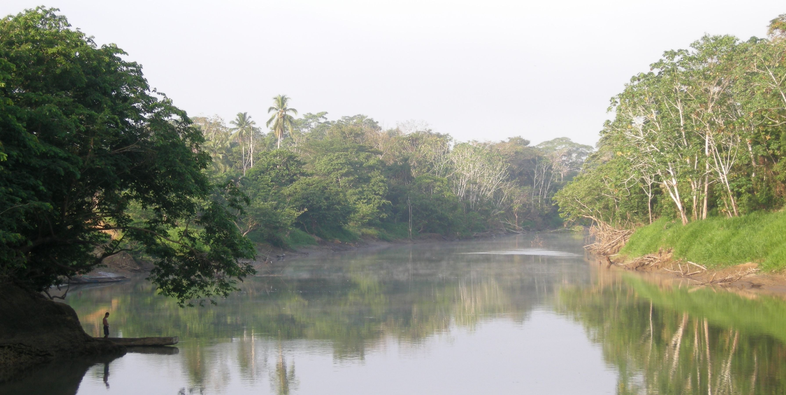
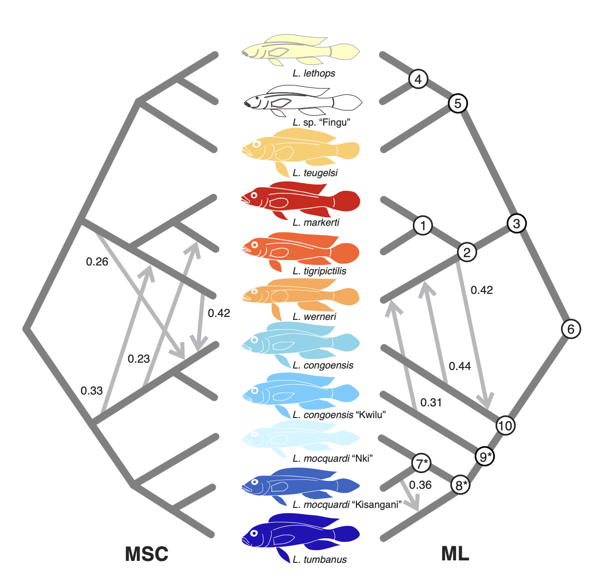
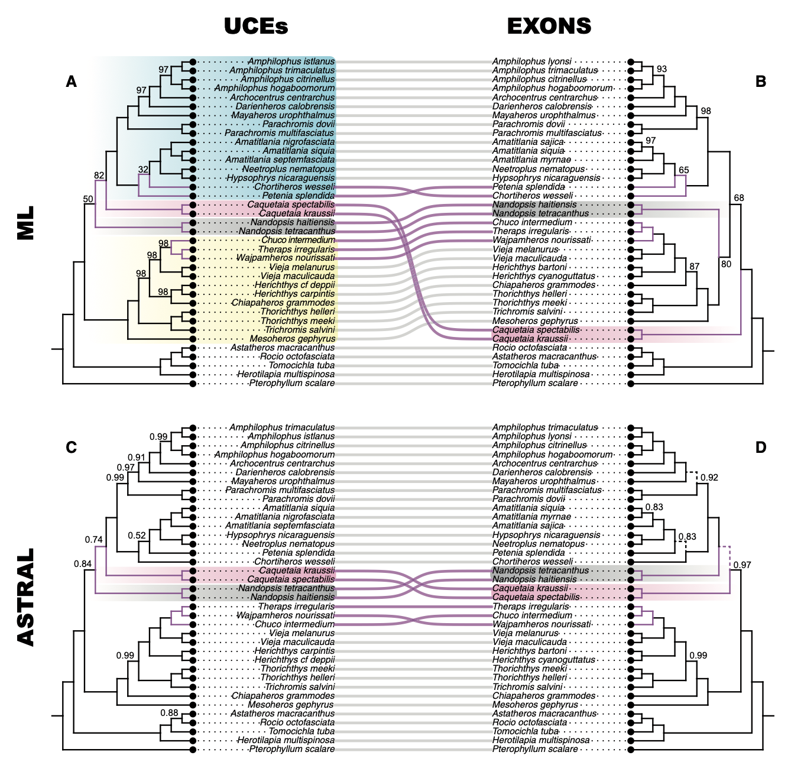
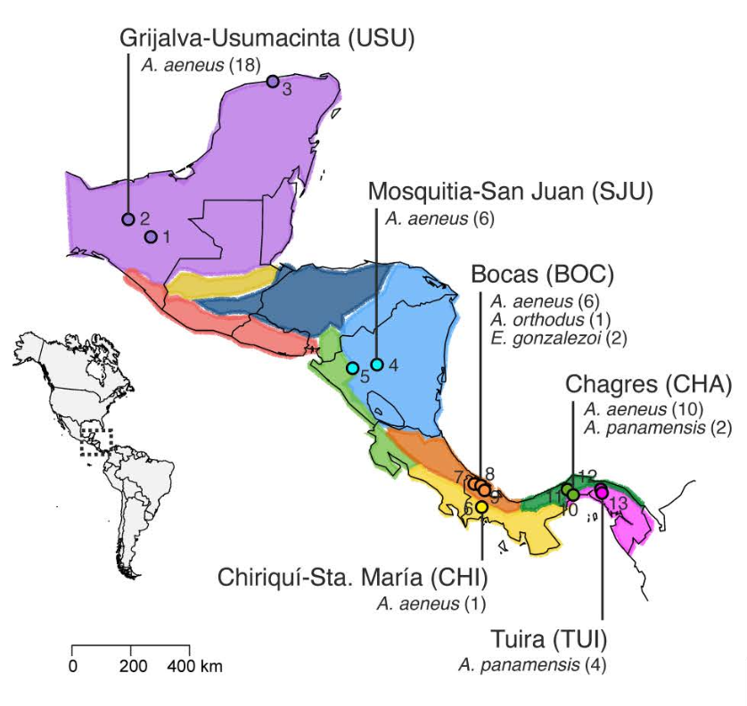
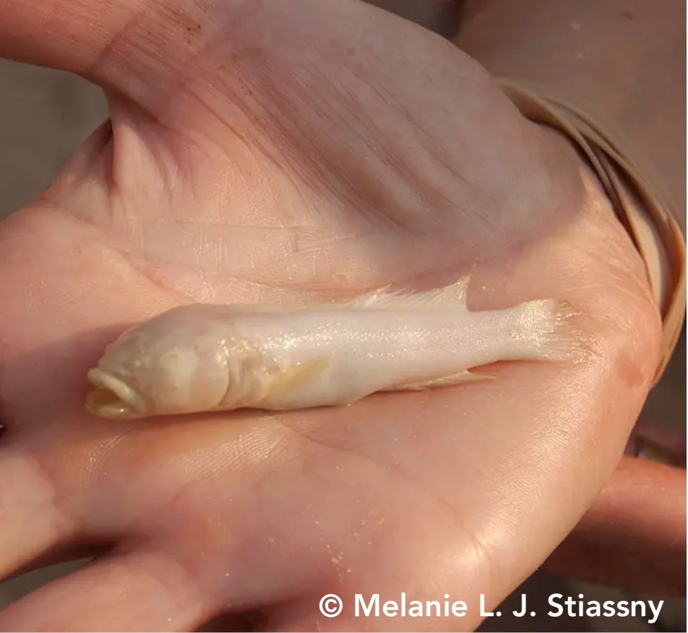
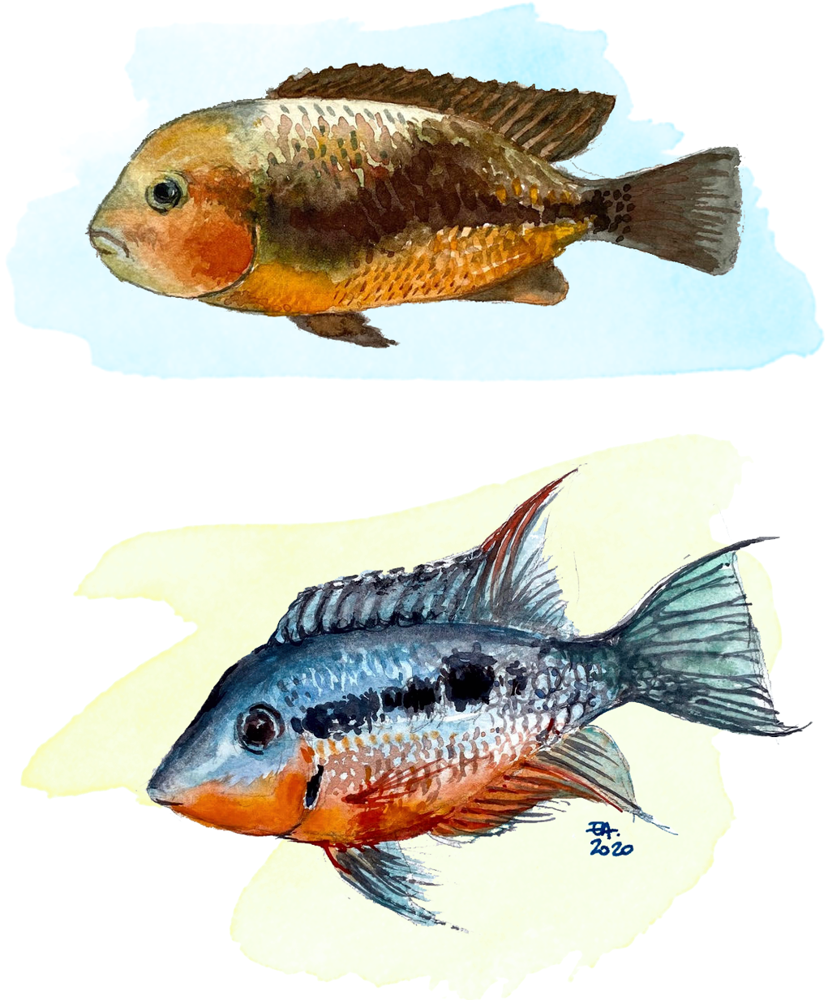
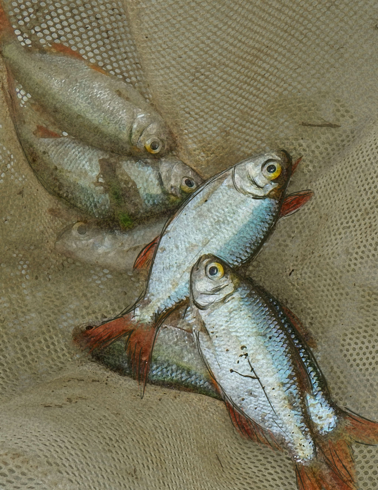

{width=100% style="height: 320px; object-fit: cover;   object-position:bottom;"}

## Research Interests

#### Our research seeks to **understand the processes that generate and shape biodiversity**, with a focus on the genomics and evolution of freshwater fishes. We integrate fieldwork, biological collections, phylogenomics, and population genomics to investigate biodiversity patterns and how ecological and geological processes interact to drive diversification across spatial and temporal scales.

#### We adopt comparative and integrative approaches across taxa, geographic regions, and evolutionary scales, combining genomic, ecological, and morphological data to link variation within populations to patterns of diversification across lineages. In doing so, we aim to understand not only how biodiversity originates, but also how species adapt and respond to environmental change.
 

## Main Research Lines
:::{.columns}

:::{.column width="33%"}
### Genomic Diversity and Fish Evolution
#### We investigate genetic and genomic diversity of freshwater fishes to uncover evolutionary history and trait evolution across rapid radiations.  [Read more »](genomic-diversity.qmd)
:::

:::{.column width="33%"}
### Phylogenomics: Data, Methods, and Inference
#### We develop and evaluate methods for genome-scale inference of species relationships, testing how different data types affect evolutionary hypotheses.  [Read more »](phylogenomics.qmd)
:::

:::{.column width="33%"}
### Biodiversity, Invasions, and Conservation
#### We study how genetic diversity, ecological interactions,and human activities shape biodiversity, including the role of invasive species and microbiomes.  [Read more »](biodiversity-conservation.qmd)
:::

:::

:::{.columns}

:::{.column width="33%"}
{width=100%}
:::

:::{.column width="33%"}
{width=100%}
:::

:::{.column width="33%"}
{width=100%}
:::
:::

:::{.columns}

:::{.column width="33%"}
{width=100%}
:::

:::{.column width="33%"}
{width=80% style="display:block; margin-left:auto; margin-right:auto;"}
:::

:::{.column width="33%"}
{width=70% style="display:block; margin-left:auto; margin-right:auto;"}
:::
:::
---

 
